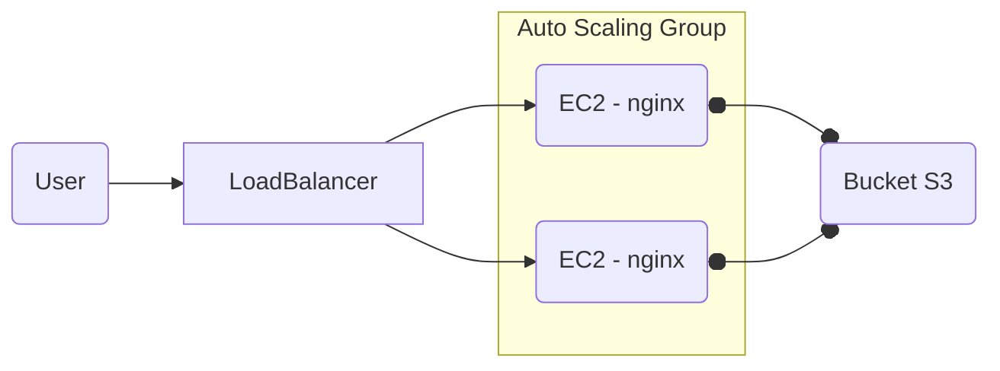
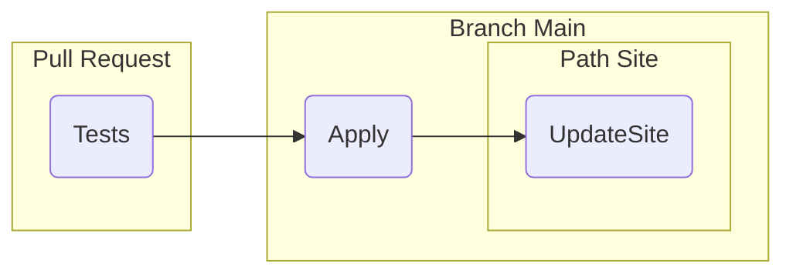

# Infra Challenge 20240202

>  This is a challenge by [Coodesh](https://coodesh.com/)

## Introdução

Este desafio faz parte de uma etapa do processo seletivo na Coodesh, no qual eu fui desafiado a criar um Webserver utilizando Nginx em uma instância EC2 com o sistema operacional Ubuntu. O objetivo é implementar Infraestrutura como Código (IaC) e adotar práticas de Entrega Contínua (Continuous Delivery).

## Estrutura de Diretórios do Projeto

- [./] -> Diretório Raiz contempla os arquivos iniciais do terraform
    - [.github](./.github/) -> Configurações do github actions
    - [modules](./modules/) -> Modulos criados do terraform visando estruturar melhor o código
    - [scripts](./scripts/) -> Scripts em shell para o user_data dos EC2 e github actions
    - [site](./site/) -> Artefatos HTML do Site

## Solução 

Para resolver o desafio, dividi as tarefas em três componentes essenciais: arquitetura de serviço, que define a infraestrutura para a execução do serviço; infraestrutura como código, encarregada de automatizar a criação da infraestrutura necessária; e entrega contínua, responsável pela entrega eficiente da solução.

### Arquitetura do Serviço 

Este componente defini a infraestrutura de execução do Webserver levando em consideração questões como segurança, escalabilidade e observabilidade.



Em termos de segurança, optei por seguir o princípio da mínima permissão necessária, definindo roles e grupos de segurança com as permissões essenciais para a execução do serviço. Além disso, tomei medidas para evitar a exposição de recursos não autorizados, como a não utilização de IPs públicos para instâncias EC2 e o armazenamento de artefatos HTML em um bucket privado.

Para criar um ambiente escalável, aproveitei os recursos de balanceamento de carga (load balancer) e grupos de dimensionamento automático (auto scaling groups) da AWS. Isso garante resiliência, disponibilidade e desempenho ao ambiente, tornando a infraestrutura mais dinâmica conforme a demanda. Implementei regras de dimensionamento para aumentar ou diminuir o número de instâncias de acordo com a variação do processamento do serviço.

Para monitorar o ambiente, utilizamos o AWS CloudWatch, aproveitando as métricas padrão dos recursos, como load balancers, auto scaling groups e instâncias EC2. Além disso, instalamos o CloudWatch Agent nas instâncias EC2 para coletar informações adicionais, como uso de disco, memória e swap e realizar o encaminhamento dos logs para o logGroup.

Um aspecto importante que abordamos foi a implementação de um padrão de tagueamento para os recursos, visando facilitar a identificação e o controle de custos do projeto.


### InfraAsCode

Para implementar a Infraestrutura como Código (IaC), escolhi o Terraform e integrei-o com o Terraform Cloud para alcançar os seguintes objetivos:

- Armazenamento do estado da infraestrutura, garantindo consistência e controle.
- Ajudar na rastreabilidade e controle das execuções da IaC, permitindo revisões e auditorias precisas.
- Gerenciamento centralizado de credenciais, promovendo a segurança e facilitando o acesso autorizado.
- Simplificar a integração com pipelines de entrega contínua, garantindo uma implementação eficiente e automatizada da infraestrutura.


### Continuos Delivery

A pipeline foi configurada no GitHub Actions com três workflows para testar e executar a Infraestrutura como Código (IaC), além de implantar o site.

- [terraform-plan.yml](./.github/workflows/terraform-plan.yml)
    - Trigger: Pull Request
    - Valida as configurações do IaC
    - Exibi as alterações do ambiente
    - Marca as alterações no Pull Request

- [terraform-apply.yml](./.github/workflows/terraform-apply.yml)
    - Trigger: branch main
    - Executa o IaC  
    - Implementação do Site

- [deploy-site.yml](./.github/workflows/deploy-site.yml)
    - Trigger: branch main & alterações no diretório site
    - Deploy do Site
    - Atualiza sempre que houver alterações na diretório [site](./site/)

É importante ressaltar que proteções foram definidas para a branch main, permitindo apenas Pull Requests aprovados e com actions de validações executadas com sucesso.



## Tecnologias utilizadas e dependências do projeto

- Infraestrutura
    - AWS EC2
        - Loadbalancer
        - SecurityGroups
        - Instance
        - Auto Scaling Group
        - Launch Templates
    - AWS IAM
        - Policy
        - Roles
        - Instance Profile
    - AWS Cloudwatch 
        - Métricas
        - LogGroup
        - Cloudwatch Agent
    - AWS VPC
        - VPC
        - Subnets
        - Internet Gateway 
        - Route Table
- Infra As Code
    - Terraform CLI (Required)
    - Terraform Cloud
- Continuos Delivery 
    - Github
    - Github Actions 
- Languages
    - HCL
    - Shell Script

## Executar localmente o IAC 

Para executar localmente o IAC é necessário ter o [terraform](https://developer.hashicorp.com/terraform/tutorials/aws-get-started/install-cli) instalado e executar os seguintes passos:

1. Comentar ou remover o trecho de configuração do Terraform Cloud no arquivo [main.tf](./main.tf)
```
  cloud {
    organization = "spedjunior" 
    workspaces { name = "coodesh-challenge" } 
    }
```
2. Configurar as credencias da AWS em seu Terminal
```
export AWS_ACCESS_KEY_ID="Valor" 
export AWS_SECRET_ACCESS_KEY="Valor"
```
3. Inicializar o projeto do terraform
```
terraform init 
```
4. Executar o terraform plan(validar as configurações)
```
terraform plan
```
5. Executar o terraform apply para iniciar a criação dos recursos
```
terraform apply 
```


